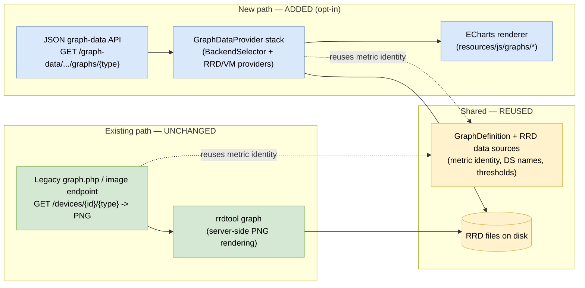
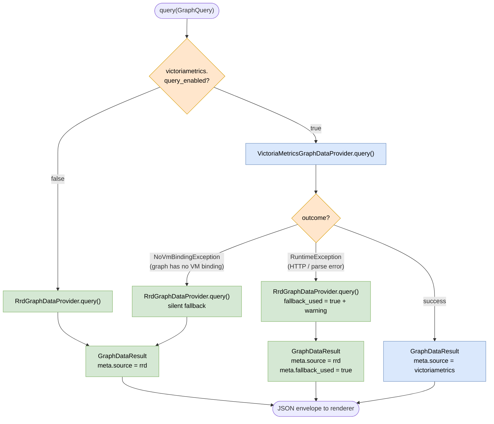
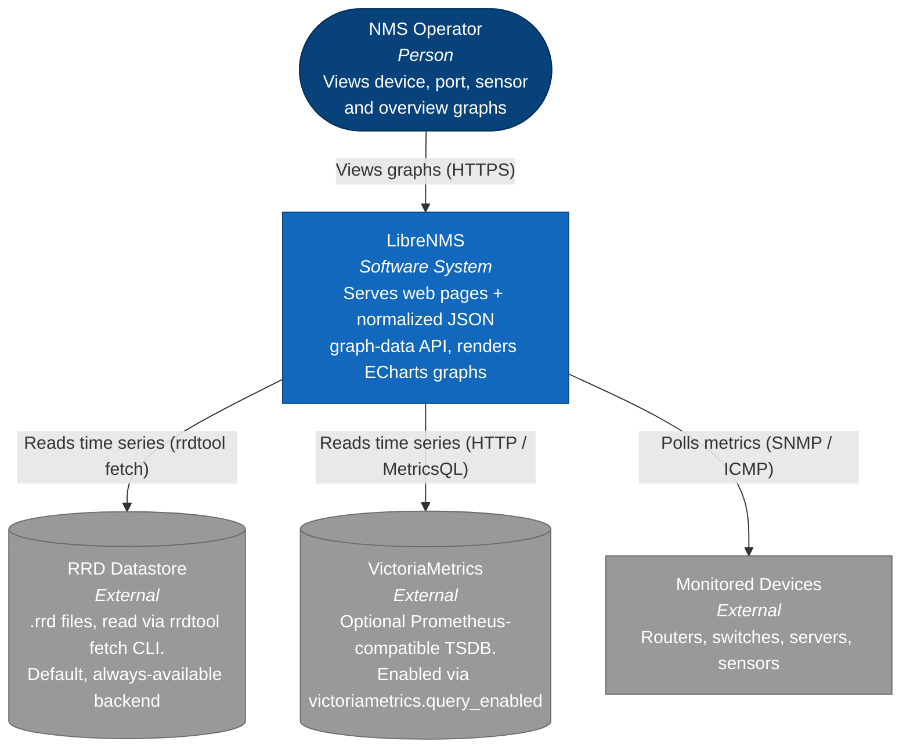
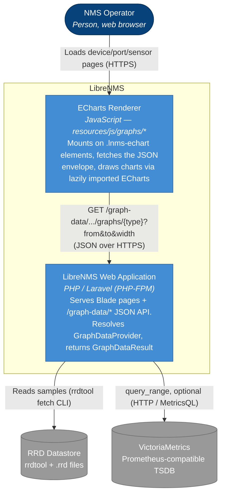
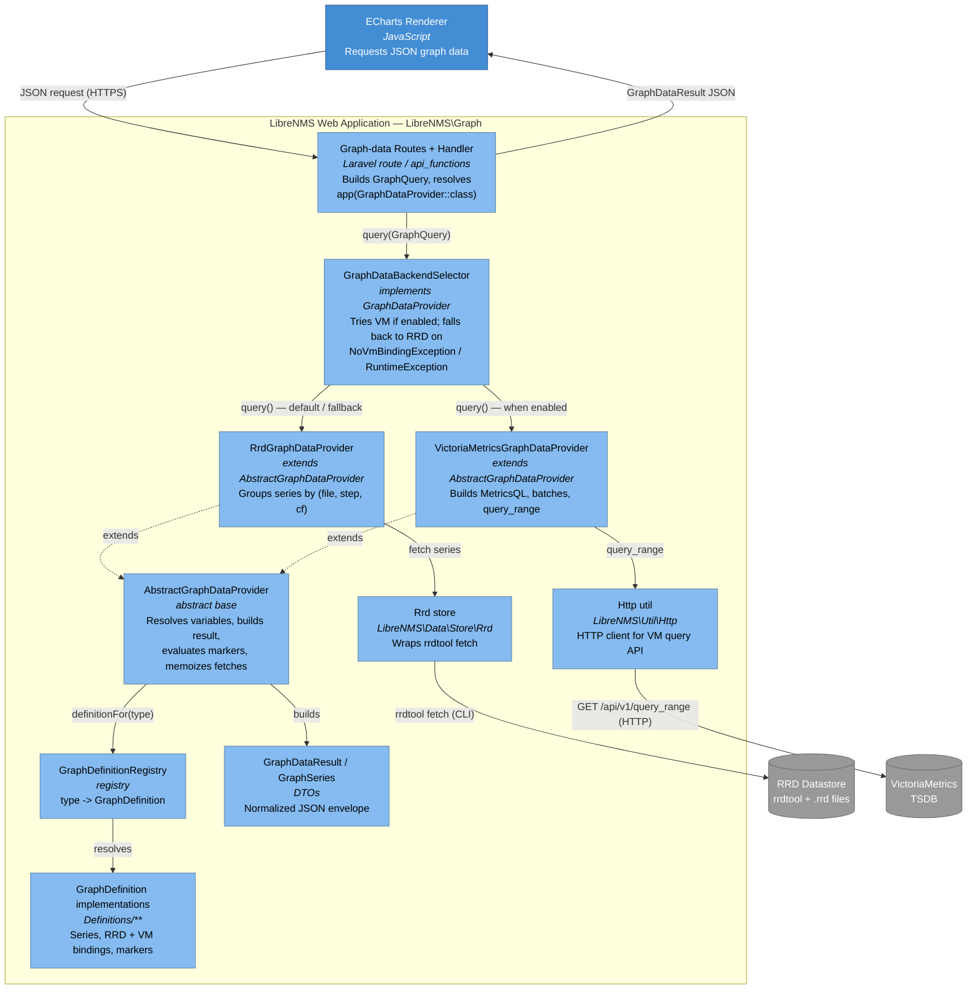
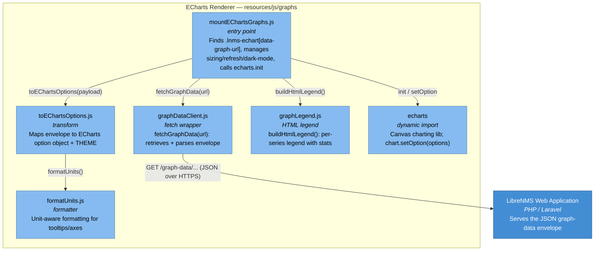
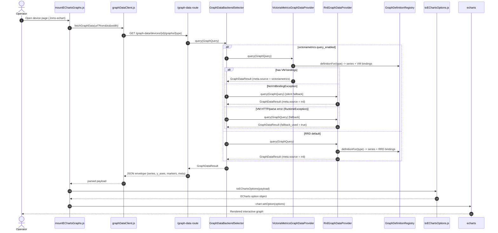

# Graph Rendering C4 Diagrams

C4 model of how LibreNMS renders ECharts graphs from time-series data held in
either the **RRD** datastore or **VictoriaMetrics**. The diagrams reflect the
actual classes described in `Graph-Data-Architecture.md`:
the backend-neutral definition layer, the `GraphDataBackendSelector` that picks a
backend, and the client-side ECharts renderer.

Diagrams use standard Mermaid `flowchart` and `sequenceDiagram` syntax so they
render reliably on GitHub and in IDE Markdown previewers (the experimental
`C4Context` syntax is not widely supported). They follow the C4 model levels:
context, container, component, and a dynamic view.

> **For reviewers:** the two diagrams immediately below frame the change in terms
> of *risk and additivity* — what stays the same, what is new. The C4 reference
> diagrams that follow describe the resulting structure in detail.

---

## Change Summary — What Is New vs. Unchanged

The new JSON graph-data API and ECharts renderer are **purely additive**. The
legacy RRDtool image endpoint and every default are untouched; there is no
cutover and no flag to flip for existing behaviour.

**Reviewer takeaways**

- **Green = unchanged:** the legacy image path keeps working exactly as before — same routes, same `rrdtool graph` PNG output, same defaults.
- **Yellow = reused:** both paths read the same RRD files and the same metric identity, so there is no data duplication or divergence.
- **Blue = new and opt-in:** nothing invokes the new path unless a client requests the new endpoint or the ECharts renderer is explicitly enabled.

---

## Backend Selection Flow

How a single `query()` call resolves to a datastore, including the automatic
fallback that guarantees RRD always answers if VictoriaMetrics cannot.

**Reviewer takeaways**

- **RRD is the default and the universal safety net:** if VM is disabled, errors, or lacks a binding for the graph, RRD answers.
- **Silent vs. surfaced fallback:** a missing VM binding (`NoVmBindingException`) is expected and silent; an unexpected VM failure (`RuntimeException`) still serves RRD but flags `meta.fallback_used` and adds a user-visible warning.
- **The client never branches on backend** — it only reads `meta.source` / `meta.fallback_used` for transparency.

---

## Level 1 — System Context

Who uses the system and which external data stores it depends on.

---

## Level 2 — Containers

The runtime building blocks. The browser renderer and the Laravel app are the two
LibreNMS-owned containers; RRD and VictoriaMetrics are external stores.

---

## Level 3a — Components: Backend (Laravel graph-data subsystem)

Inside the `LibreNMS\Graph` namespace. `GraphServiceProvider` binds the
`GraphDataProvider` interface to a `GraphDataBackendSelector`, which delegates to
the RRD or VictoriaMetrics provider.

---

## Level 3b — Components: Frontend (ECharts renderer)

Inside `resources/js/graphs/`. ECharts itself is loaded with a dynamic `import('echarts')`
so it adds zero bundle weight when the renderer is not used.

---

## Dynamic View — Rendering one graph

End-to-end flow for a single graph, showing the RRD-vs-VictoriaMetrics branch and
the automatic fallback.

---

## Notes

- **Single contract:** every backend implements `GraphDataProvider::query(GraphQuery): GraphDataResult`. The browser is unaware of which datastore served the data except via `meta.source` / `meta.fallback_used`.
- **Backend selection** is config-driven in `GraphDataBackendSelector`; RRD is the default and the universal fallback.
- **Definitions are backend-neutral:** each `GraphSeriesDefinition` carries both an `RrdMetricBinding` and an optional VictoriaMetrics binding, so one definition serves both stores.
- **Renderer is presentation-only:** ECharts JS does not recompute percentiles, totals or thresholds — those arrive pre-computed in the envelope.
